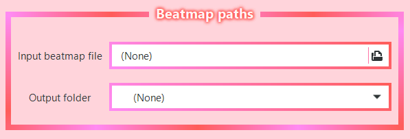
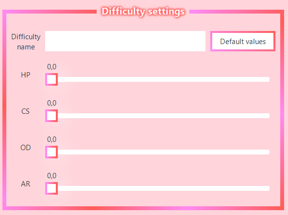
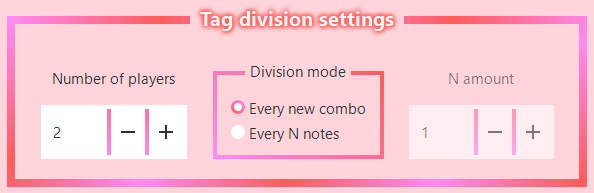
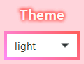

<div align="center">


# OsuTagDivider
A tool that divides osu beatmaps in tag co-op style, made to help create videos like these:


<a href="http://www.youtube.com/watch?feature=player_embedded&v=eJ9-RvHz5Rg
" target="_blank"></a>
<a href="http://www.youtube.com/watch?feature=player_embedded&v=5svqMf2P7xA
" target="_blank"></a>

</div>

# <div align="center">How to use / Panel overview</div>

## Beatmap paths panel


- You start by selecting what beatmap (.osu file) you want to divide using the `Input beatmap file` picker.

- If your beatmap file is invalid in any way, a message box will pop up with the error message.

- After you select a beatmap, the Output folder will be automatically set to the same directory.

## Difficulty settings panel


- After your beatmap successfully loads, this panel will be initialized with the beatmap's data.

- For each difficulty this tool generates, the difficulty name will be taken from the `Difficulty Name` label with an appended index, to distinguish each difficulty.

- You can fetch original values of the loaded beatmap, by pressing the `Default values` button.

## Tag division settings


- The `Number of players` spinner determines how many difficulties will be generated.

- The `Division mode` box lets you decide what algorithm is used to divide your beatmap:
    1. `Every new combo`: Notes will be passed to the next player whenever a new combo appears. (Useful for classic TAG maps or for creating your own division with a custom difficulty)

    2. `Every N notes`: Notes will be passed to the next player every `N` notes. You can select the `N` value with the `N amount` spinner. (Useful for impossible maps)

## Generate button


- After you're done configuring the tool, you can press this big and ominous button!

- Afterwards, a message box will appear indicating if generation was successful or not.

# <div align="center">Settings</div>

The `data` folder contains information used by the tool in a human readable format.

- On the windows portable build the `data` folder is located inside the `bin` folder in the same location as the executable.

- On the linux build the first time you run the tool, an `OsuTagDivider` folder will be created in the `~/.local/share` directory. This is where the `data` folder will be located.

## Config

Inside the `data` folder a `config.ini` file is located which will contain two fields:

- `selected_theme`: the currently selected theme. Default: `light`
- `default_path`: the folder the `Input beatmap file` picker will default to when selecting a file. Default: `-` (the tool will try fetching the default osu! location and replace the dash)

## Theming


- This tool supports theming and comes with a few predefined color presets.

- The default theme can be accessed in the `data/themes` folder. Color presets for that theme are located in `data/themes/color`.

- You can create a custom color preset by adding a new `.css` file to the `data/themes/color` folder. The file MUST include the same color definitions as the existing presets, but you can change the values. The tool will automatically detect new presets the next time it runs.

# <div align="center">Build instructions</div>

## Linux
Dependencies: `g++ cmake pkg-config libgtk-3-dev libgtkmm-3.0-dev`

Build instructions (inside cloned repo folder):
```shell
mkdir build
cd build
cmake ..
make
```

## Windows
Follow [this tutorial](https://thegameratort.github.io/gtkmm_tutorial.html)

If you're struggling to run your build, put the executable and the `data` folder inside `your-msys2-installation\mingw64\bin` and try running it in there.

