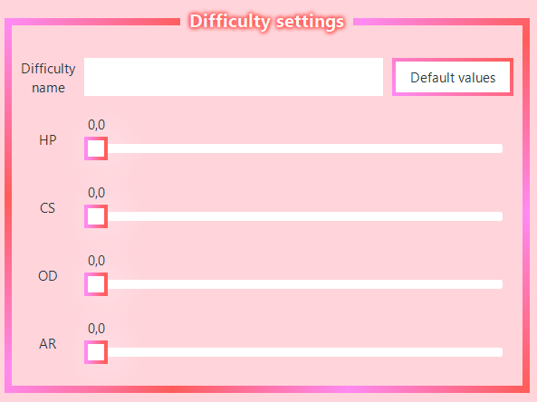

# OsuTagDivider
A tool that divides osu beatmaps in tag co-op style, made to help create videos like these:

# 
How to use / Panel overview

## Beatmap paths panel

- You start by selecting what beatmap (.osu file) you want to divide using the `Input beatmap file` picker.

- If your beatmap file is invalid in any way, a message box will pop up with the error message.

- After you select a beatmap, the Output folder will automatically be set to the same folder as the input beatmap.

## Difficulty settings panel

- After your beatmap successfully loads, this panel will initialize with the loaded data.

- For each generated beatmap, the difficulty name is taken from the `Difficulty Name` label, with the index of the beatmap appended.

- You can fetch the original values from the beatmap by pressing the `Default values` button.

## Tag division settings

- The `Number of players` spinner, essentially describes how many beatmaps will be generated.

- The `Division mode` box let's you decide what algorithm is used to divide your beatmap:
    1. `Every new combo`: Notes will be passed to the next player whenever a new combo appears. (Useful for classic TAG maps or for creating your own division with a custom difficulty)

    2. `Every N notes`: Notes will be passed to the next player every `N` notes. You can select the `N` value with the `N amount` spinner. (Useful for impossible maps)

## Generate button

- After you're done configuring the tool, you can press this big and ominous button!

- Afterwards a message box will appear indicating if generation was successful or not.

# 
Settings

The `data` folder contains information used by the tool in a human readable format.

- On the windows portable build the `data` folder is located inside the `bin` folder in the same location as the executable.

- On the linux build the first time you run the tool, an `OsuTagDivider` folder will be created in the `~/.local/share` directory. This is where the `data` folder will be located.

## Config

Inside the `data` folder a `config.ini` file is located which will contain two fields:

- `selected_theme`: the currently selected theme. Default: `light`
- `default_path`: the folder the `Input beatmap file` picker will default to when selecting a file. Default: `-` (the tool will attempt to locate your osu beatmap folder)

## Theming

- This tool supports theming and comes with a few predefined color themes.

- Color themes can be accessed in the `data` folder, specifically in `data/themes/color`.

- You can create your own color theme by creating a new .css file in that folder. You have to follow the convention other color themes follow, unless you plan to create your own theme from scratch. I suggest copy-pasting an existing color theme and changing the color values!

# 
Build instructions

## Linux
Dependencies: `g++ cmake pkg-config libgtk-3-dev libgtkmm-3.0-dev`

Build with `cmake .` and then `make` inside the cloned repo folder

## Windows
Follow [this tutorial](https://thegameratort.github.io/gtkmm_tutorial.html)

If you're struggling to run your build, put it and the `data` folder inside `your-msys2-installation\mingw64\bin`

